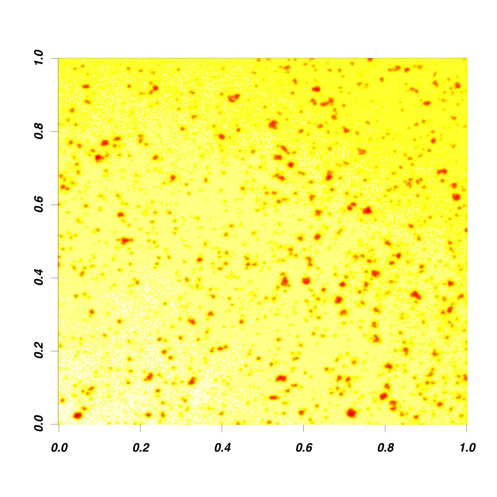
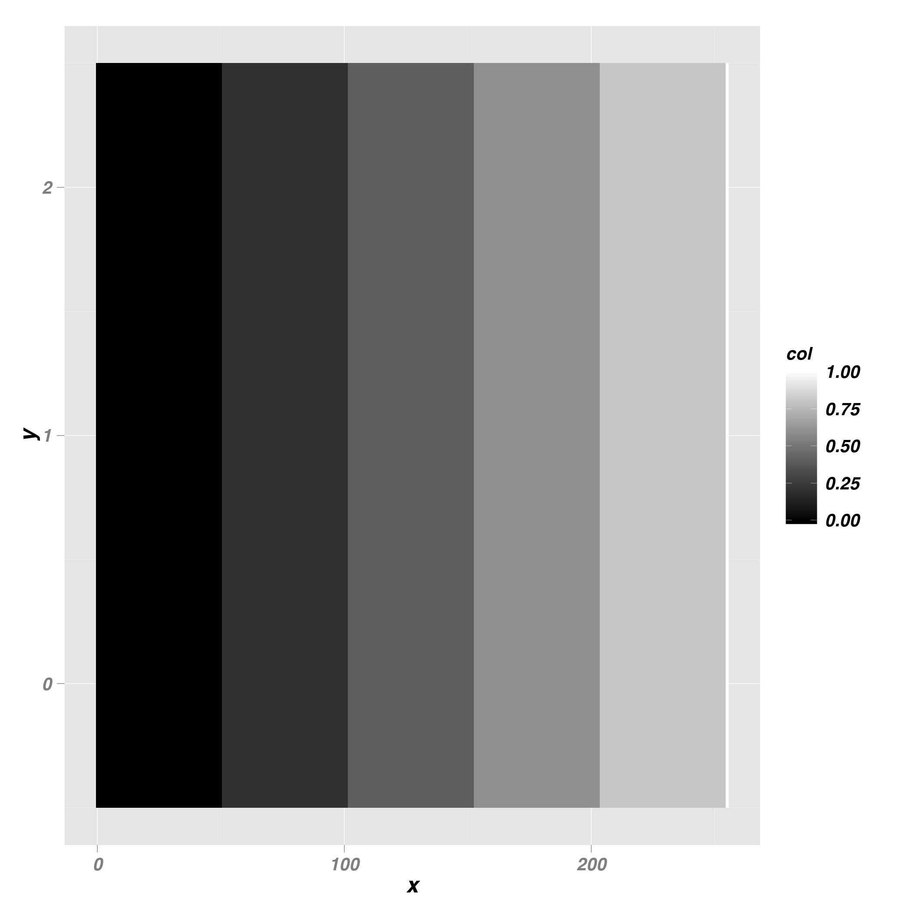

Exercise 1 Slides
========================================================
author: Kevin Mader, Maria Büchner
date: 20 February 2014

Tools for the Exercise
========================================================

- Matlab (General Processing, Image Processing Toolbox)
[http://www.mathworks.com]
- FIJI (ImageJ with all the plugins already installed): Visualization, Preprocessing, Segmentation, Morphometrics [http://www.fiji.sc]

Setting up the Computers
========================================================

Once you have logged in

Open a terminal (Accessories -> Terminal)

Type in the following commands **exactly**!

This will start Fiji

Setting up the Computers
========================================================
```
cd /scratch
curl -o qbi.zip http://people.ee.ethz.ch/~maderk/qbi.zip
unzip qbi.zip
cd qbi/
Fiji.app/ImageJ-linux64
```
Fiji Introduction
========================================================
Watch this video to see how to open data and visualize it in Fiji
http://people.ee.ethz.ch/~maderk/videos/StartingAndVisualizing.swf


Other Datasets
========================================================
The data are in a folder called data inside the qbi folder you just created
* Open with: Fiji/File -> Open ...
 * pivo5,6,7raw.tif : A beer foam measured using propagation-based phase contrast at -- different times
 * cortical-056_A/B.tif a section of cortical bone taken from a mouse

The same in Matlab
========================================================
* Make a new terminal  (Accessories -> Terminal)
* Start matlab by typing
```
matlab
```
* Change to the image directory by typing   
```
cd /scratch/qbi/data/
```

Loading an image
========================================================
* Matlab was designed to process matrices and arrays and consequently treats images as matrices
* Matlab has several built in functions for handling images but offers many more in the Image Processing Toolbox (images). 
* You can get an overview of the functions available using the follwing command  
```
help images
```
* You can load the image of cortical bone into a variable called _cort_img_ by using the _imread_ command 
```
cort_img=imread('cortical-056_A.tif');
```

Showing an image
========================================================
* You can show the image using the _imagesc_ command  
```
imagesc(cort_img);
```
* You can create a histogram for the image using the hist command  
```
hist(double(cort_img(:));
```

Loading an image
========================================================
* Load the cell image and show it
```
cellImage=imread('http://imagej.nih.gov/ij/images/Cell_Colony.jpg');
cellImage=double(cellImage);
imagesc(cellImage);
```
 


Show a histogram
========================================================
```
hist(cellImage(:));
```
 


Why do we need quantitative metrics?
========================================================
* Situationally dependent performance  
Are the bands uniform in brightness?
 


Why do we need quantitative metrics?
========================================================
 

***
 


